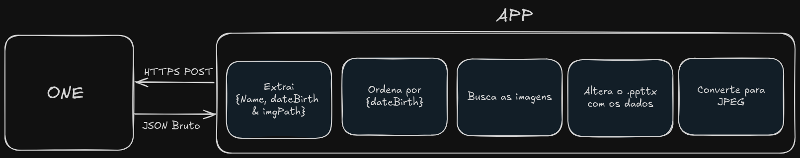
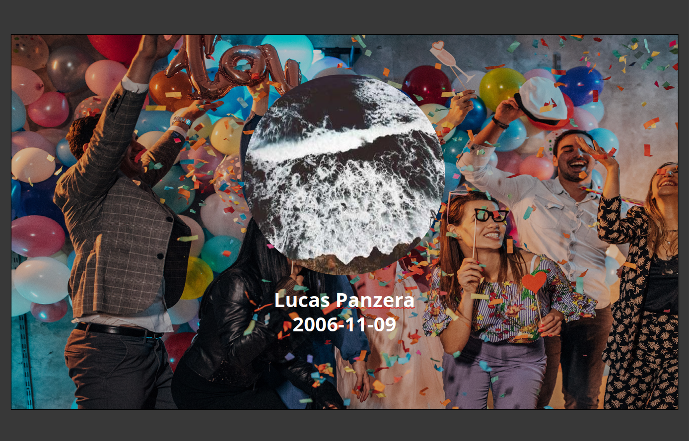

# auto-birthday-pptx
### Ideia principal:
A ideia é que o pessoal do Facilities, tenha uma interface web, onde podem verificar os aniversariantes do mês, e baixar a imagem padrão de feliz aniversário, pronta para enviarem para o bocão.

### Atualmente
Atualmente o processo de fazer a mensagem de aniversário é bem manual, eles devem buscar um processo dentro do ONE, abrir pequenos modais, para verem quem faz aniversário em cada dia, baixar a foto, abrir o template da mensagem, alterar a foto e nome de forma manual.

## Como funciona?
* Existe um template .pptx, com uma imagem e placeholders {{NOME}}{{DATA_NASCIMENTO}}
* o index.js:
* - Lê o template direcionado.
* - Lê a "requisição" exemplo-api.json
* - Baixa a imagem do colaborador
* - Subistitui a imagem e placeholders do template
* - Gera um output com as alterções.




##### Template com placeholders


```bash
🚀 Iniciando automação do PowerPoint com Template...
🔄 Buscando dados...
📁 Lendo arquivo: /home/panzera/Área de trabalho/auto-birthday-pptx/exemplo-api.json
✅ Dados obtidos: {
  nome: 'Lucas Panzera',
  dataNascimento: '2006-11-09',
  imagemUrl: 'https://picsum.photos/400/300?random=1'
}
🔄 Modificando template...
✅ Template encontrado
🔄 Baixando imagem...
✅ Imagem baixada com sucesso
🔄 Processando 1 slide(s)...
🔄 Substituindo imagem...
✅ Template modificado com sucesso!
📁 Arquivo salvo em: output/apresentacao_Lucas_Panzera_1754354074904.pptx
🎉 Processo concluído com sucesso!
📄 Arquivo criado: output/apresentacao_Lucas_Panzera_1754354074904.pptx
```

##### Outputs com dados da requisição



